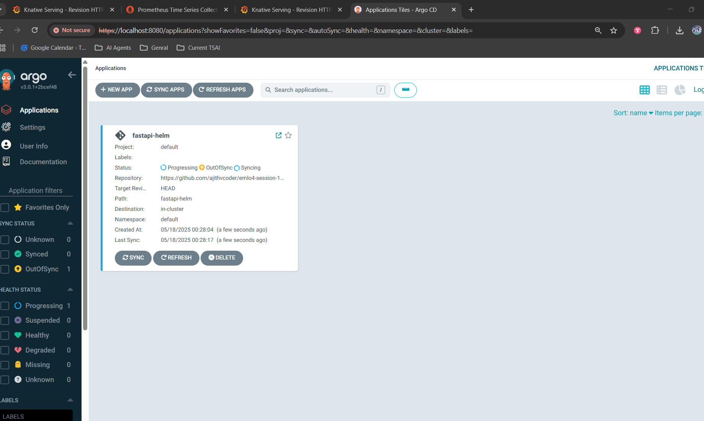
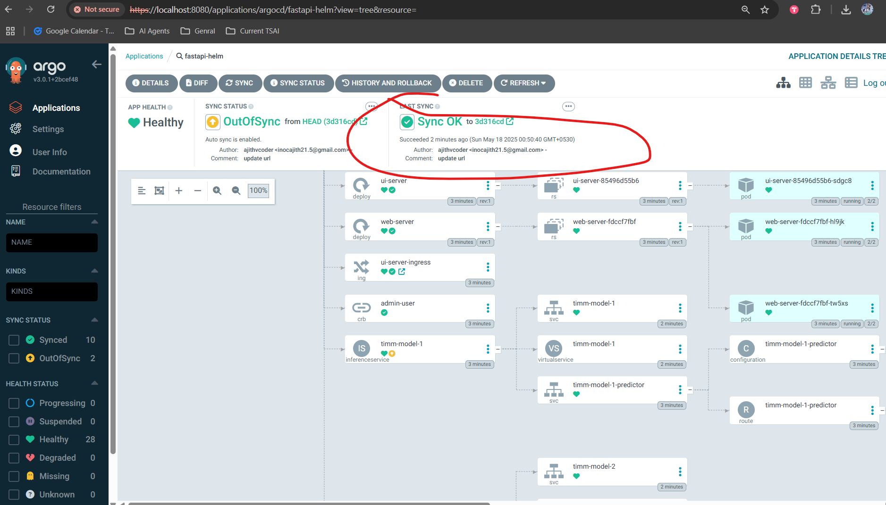
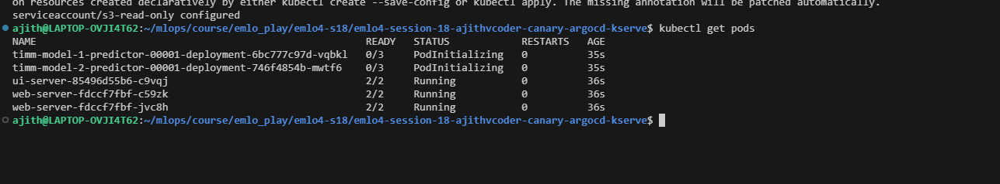
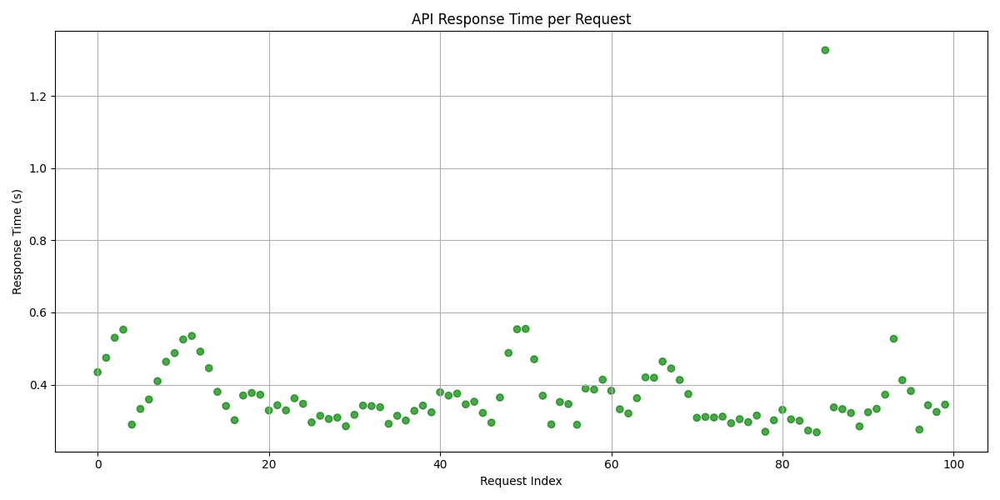
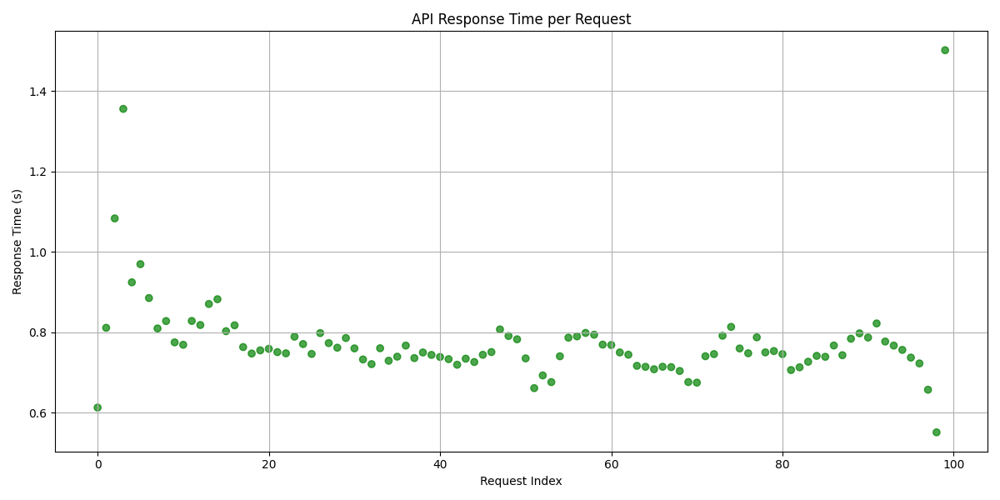

### EMLOV4-Session-18 Assignment - ArgoCD Deployment

This is part of [capstone project](https://github.com/ajithvcoder/E2EMLOps)
which helps in argo CD deployment.

Note: Please refer [Assignment-18 repo](https://github.com/ajithvcoder/E2EMLOps) - `https://github.com/ajithvcoder/E2EMLOps` for instructions to develop and deploy from scratch

- Have s3-secret.yaml file in argo-apps/s3-secret.yaml folder and update it with your AWS credentails i.e `AWS_ACCESS_KEY_ID` and `AWS_SECRET_ACCESS_KEY`

```
apiVersion: v1
kind: Secret
metadata:
  name: s3creds
  annotations:
     serving.kserve.io/s3-endpoint: s3.ap-south-1.amazonaws.com # replace with your s3 endpoint e.g minio-service.kubeflow:9000
     serving.kserve.io/s3-usehttps: "1" # by default 1, if testing with minio you can set to 0
     serving.kserve.io/s3-region: "ap-south-1"
     serving.kserve.io/s3-useanoncredential: "false" # omitting this is the same as false, if true will ignore provided credential and use anonymous credentials
type: Opaque
stringData: # use `stringData` for raw credential string or `data` for base64 encoded string
  AWS_ACCESS_KEY_ID: AKXXXXXXXXXXXXXXXXXXXXX
  AWS_SECRET_ACCESS_KEY: "RQHBUNBSJNINQONUKNUKXXXXXX+XQIWOW"

---

apiVersion: v1
kind: ServiceAccount
metadata:
  name: s3-read-only
secrets:
- name: s3creds
```

- Create the repo before you start and update the repo url in `argo-apps/models.yaml` file

Deployment

```bash
kubectl apply -f argo-apps
```

**Load tests**

*Note: Make sure you change the models ALB url while testing

- `python utils/test_load_sports_2.py` 
- `python utils/test_load_vegfruits_2.py` 

**Results**

*Note additional results can be reffered in the source repo for this assignment [capstone project](https://github.com/ajithvcoder/E2EMLOps)
which helps in argo CD deployment.

**Argo CD Deployment**







**Load test results**






**Delete argocd deployments**

Verify app name
- `kubectl get app -n argocd`

Delete cascade
- `kubectl patch app model-deployments  -p '{"metadata": {"finalizers": ["resources-finalizer.argocd.argoproj.io"]}}' --type merge -n argocd`
- `kubectl delete app model-deployments -n argocd`

Deletion
- `eksctl delete cluster -f eks-cluster.yaml --disable-nodegroup-eviction`

**Wait paitently see all deletion is successfull in aws cloud formation stack page and then close the system because some times
the deletion gets failed so at backend something would be running and it may cost you high**
**If you triggering a spot instance manually with `peresistent` type ensure that both the spot request is cancelled manually
and the AWS instance is terminated finally**

